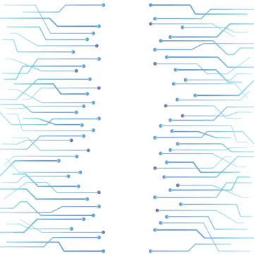

<!--
  Reference deck for the ntc.css MARP theme.

  Render with:
      marp reference.marp.md --html --theme ntc.css -o reference.html
      marp reference.marp.md --html --theme ntc.css --pdf

  The --html flag is required for highlight-boxes and inline status pills,
  which are written as raw HTML inside markdown.
-->

<!-- _class: lead -->
<!-- _paginate: false -->

# NTC MARP Theme

## A reference deck for ntc.css

Network to Code · v1.0

---

<!-- _class: chapter -->
<!-- _paginate: false -->

## 01

# Slide layouts

---

# Seven slide layouts

## How to use them

Apply any of these per-slide with `<!-- _class: name -->` in markdown. Combine with `<!-- _paginate: false -->` to suppress page numbers on covers and dividers.

- **default** — content slide with chevron-prefixed `h1` and a footer rule
- **lead** — title slide, dark city background, white headline
- **chapter** — section divider, blue city background, orange section number
- **split** — left-rail title, content on the right
- **middle** — vertically centered content
- **cols-2** — h1/h2 span the slide; remaining content flows into two columns
- **text-image** — text on the left, image on the right

---

<!-- _class: split -->

# Split layout

## When to use

The split layout pins a title to a dark sidebar on the left and gives the rest of the slide over to content. Use it to anchor a long-form discussion to a single idea — a title that needs to stay visible while the audience reads.

Body copy, lists and `inline code` render exactly as they would on a default slide. Keep the sidebar title to a few words; the rail is narrow.

---

<!-- _class: middle -->

# Middle-aligned content

## `_class: middle`

This entire slide body is vertically centered between top and bottom. Reach for it when a single idea, quote, or small table deserves to dominate the slide without leaving the eye chasing it from the top.

---

<!-- _class: middle -->

# Quarterly summary

## A centered table

| Site  | Devices | Active | Planned | Last sync (UTC) |
|-------|---------|--------|---------|-----------------|
| ams01 | 18      | 16     | 2       | 2026-05-18 04:00 |
| fra01 | 12      | 12     | 0       | 2026-05-18 04:01 |
| lon01 | 9       | 7      | 2       | 2026-05-18 04:00 |
| dca01 | 21      | 20     | 1       | 2026-05-18 04:02 |

---

<!-- _class: cols-2 -->

# Side by side

## `_class: cols-2`

| Device          | Role         |
|-----------------|--------------|
| ams01-core-01   | core         |
| ams01-dist-01   | distribution |
| ams01-access-01 | access       |
| ams01-access-02 | access       |

| Prefix         | Site  | Role     |
|----------------|-------|----------|
| 10.0.0.0/24    | ams01 | loopback |
| 10.0.1.0/24    | ams01 | p2p      |
| 10.0.2.0/24    | fra01 | loopback |
| 10.0.3.0/24    | lon01 | loopback |

---

<!-- _class: text-image -->

# Reference architecture

## `_class: text-image`

The Nautobot reference architecture combines a relational database, a job runner, and a REST/GraphQL API. The front-end is a React app served by Django.

Workflows enter through the API, get scheduled by Celery, and write back via Source-of-Truth jobs. The right-hand image slot accepts any markdown image — swap in any diagram with ``.



---

<!-- _class: chapter -->
<!-- _paginate: false -->

## 02

# Typography & elements

---

# Typography

## Type roles in one slide

Body copy is **Ubuntu** at 28 px on a 1.45 line-height. Use **strong** for emphasis and *italic* sparingly. Inline `code` is Ubuntu Mono in brand orange, e.g. `nautobot-server migrate`.

- Bulleted lists use orange markers
  - Two levels of nesting, max
  - Keep items short and parallel
- Numbered lists work too:
  1. First, define intent
  2. Then, render config
  3. Finally, push and verify

Links: [docs.nautobot.com](https://docs.nautobot.com)

> Blockquotes are subdued, italic, and carry a neutral left rule. Use them for callouts that aren't urgent enough to warrant a highlight box.

---

# Code blocks

## YAML — device intent

```yaml
devices:
  - name: ams01-dist-01
    role: distribution
    site: ams01
    platform: juniper_junos
    interfaces:
      - name: xe-0/0/0
        description: "Uplink to ams01-core-01"
        type: 10gbase-x-sfpp
        ip_addresses:
          - 10.0.0.1/31
      - name: xe-0/0/1
        description: "Uplink to ams01-core-02"
        type: 10gbase-x-sfpp
        ip_addresses:
          - 10.0.0.3/31
```

---

# Tables

## Devices in `ams01`

| Name             | Role          | Status   | Manufacturer | Primary IP    |
|------------------|---------------|----------|--------------|---------------|
| ams01-core-01    | core          | Active   | Juniper      | 10.0.0.0/31   |
| ams01-core-02    | core          | Active   | Juniper      | 10.0.0.2/31   |
| ams01-dist-01    | distribution  | Active   | Juniper      | 10.0.0.4/31   |
| ams01-dist-02    | distribution  | Active   | Juniper      | 10.0.0.6/31   |
| ams01-access-01  | access        | Active   | Arista       | 10.0.0.8/31   |
| ams01-access-02  | access        | Planned  | Arista       | —             |

Tables use the design system's tight cell padding and a blue row-hover.

---

<!-- _class: chapter -->
<!-- _paginate: false -->

## 03

# Content components

---

# Highlight boxes

## Four semantic variants

<div class="highlight-box">
<strong>Info.</strong> The default highlight box has a blue accent stripe. Use it for neutral callouts, sidebars and pointers to documentation.
</div>

<div class="highlight-box warning">
<strong>Warning.</strong> Orange accent — caveats, breaking changes, things the audience needs to read before moving on.
</div>

<div class="highlight-box success">
<strong>Success.</strong> Green accent — completed jobs, healthy state, expected outcomes.
</div>

<div class="highlight-box danger">
<strong>Danger.</strong> Red accent — failures, destructive actions, irreversible operations.
</div>

---

<!-- _class: grid-2x3 -->

# Card grid

## 2×3 (2 rows of 3)

- <span class="status status-green">Active</span> **ams01-dist-01** · Juniper MX480 · distribution
- <span class="status status-blue">Planned</span> **ams01-access-02** · Arista 7050X · awaiting install
- <span class="status status-yellow">Maintenance</span> **ams01-core-01** · Juniper MX960 · patch window
- <span class="status status-red">Offline</span> **fra01-edge-02** · Cisco ASR · last seen 2h ago
- <span class="status status-green">Active</span> **dca01-spine-01** · Cisco Nexus 9504 · fabric spine
- <span class="status status-red">Decommissioning</span> **lon01-leaf-12** · Arista 7050X · hardware RMA

---

<!-- _class: grid-3x2 -->

# Card grid

## 3×2 (3 rows of 2)

- <span class="status status-green">Active</span> **ams01-dist-01** · Juniper MX480 · distribution
- <span class="status status-blue">Planned</span> **ams01-access-02** · Arista 7050X · awaiting install
- <span class="status status-yellow">Maintenance</span> **ams01-core-01** · Juniper MX960 · patch window
- <span class="status status-red">Offline</span> **fra01-edge-02** · Cisco ASR · last seen 2h ago
- <span class="status status-green">Active</span> **dca01-spine-01** · Cisco Nexus 9504 · fabric spine
- <span class="status status-red">Decommissioning</span> **lon01-leaf-12** · Arista 7050X · hardware RMA

---

# Putting it together

## A typical content slide

The header carries the orange `>>>` chevron and a neutral title. The eyebrow `h2` sits below in uppercase orange. Combine prose, components and code freely.

<div class="highlight-box warning">
<strong>Heads up.</strong> Raw HTML blocks (highlight boxes and inline status pills) require Marp's <code>--html</code> flag or <code>html: true</code> in your Marp config.
</div>

```bash
marp reference.marp.md --html --theme ntc.css -o reference.html
marp reference.marp.md --html --theme ntc.css --pdf
```

---

<!-- _class: lead -->
<!-- _paginate: false -->

# Thank you

## ntc.css reference deck

github.com/networktocode · v1.0
